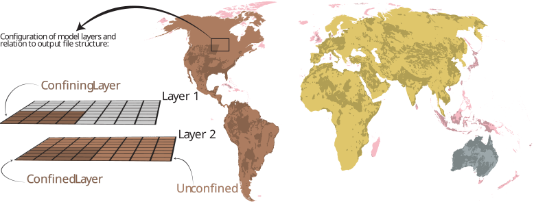

```{python}
#| echo: false
#| output: false
import sys
from pathlib import Path

sys.path.insert(0, str(Path.cwd()))

import _catalogue as cat
from itables import init_notebook_mode
from IPython.display import HTML, display

reference = cat.load_reference()
scenarios = cat.load_scenarios()
quality = cat.load_quality()
```

```{python}
#| echo: false
# Embeds the bundled DataTables build instead of fetching it from a CDN at page
# load. Keep this cell's output - the tables stop working without it.
init_notebook_mode(all_interactive=False, connected=False)
```

```{python}
#| echo: false
#| output: asis

def _card(anchor, css, icon, title, purpose, meta):
    items = "".join(
        f'<li><span class="dataset-meta-label">{k}</span>'
        f'<span class="dataset-meta-value">{v}</span></li>'
        for k, v in meta
    )
    return f"""
  <div class="dataset-item {css}">
    <div class="dataset-avatar"><span class="dataset-icon">{icon}</span></div>
    <div class="dataset-content">
      <h3 class="dataset-title"><a href="#{anchor}">{title}</a></h3>
      <p class="dataset-purpose">{purpose}</p>
      <ul class="dataset-meta">{items}</ul>
    </div>
  </div>"""

cards = [
    _card(
        "historical-reference", "dataset-reference", "&#127758;",
        "Historical reference",
        "What happened. Observation-forced, for validation and attribution.",
        [
            ("Forcing", "GSWP3-W5E5"),
            ("Period", "1960&ndash;2019"),
            ("Files", f"{len(reference)}"),
            ("Size", cat.format_size(reference["Size (GiB)"].sum())),
        ],
    ),
    _card(
        "scenarios", "dataset-scenarios", "&#128200;",
        "Scenarios",
        "What could happen. GCM-forced, baseline plus three SSPs.",
        [
            ("Forcing", "5 CMIP6 GCMs"),
            ("Period", "1960&ndash;2014, 2015&ndash;2100"),
            ("Files", f"{len(scenarios)}"),
            ("Size", cat.format_size(scenarios["Size (GiB)"].sum())),
        ],
    ),
    _card(
        "quality-assurance", "dataset-quality", "&#9888;&#65039;",
        "Quality assurance",
        "Simulation quality information.",
        [
            ("Forcing", "&mdash;"),
            ("Coverage", "Global"),
            ("Layers", f"{len(quality)}"),
            ("Status", "Awaiting deposit"),
        ],
    ),
]

display(HTML(
    '<div class="dataset-highlight dataset-highlight-3">'
    + "".join(cards)
    + "</div>"
))
```


GLOBGM is a two-layer groundwater model, with outputs available for both layers. Properly interpreting these layers is essential for selecting the appropriate data in your analysis.

The aquifer type at any location is determined by the data presence in each layer:

-   **Confined System:** Occurs where Layer 1 contains valid data, representing the confining layer (aquitard), with Layer 2 data corresponding to the underlying confined aquifer.

-   **Unconfined System:** Identified where Layer 1 is null (no data) and Layer 2 has valid data, indicating an unconfined aquifer in Layer 2.

{fig-align="center"}

## Historical reference {#historical-reference}

```{python}
#| echo: false
#| output: asis
display(HTML(f"""
<div class="catalogue-spec">
  <div><span class="catalogue-spec-label">Forcing</span>
       <span class="catalogue-spec-value">GSWP3-W5E5 (observational)</span></div>
  <div><span class="catalogue-spec-label">Period</span>
       <span class="catalogue-spec-value">1960&ndash;2019</span></div>
  <div><span class="catalogue-spec-label">Members</span>
       <span class="catalogue-spec-value">Single run, no ensemble</span></div>
  <div><span class="catalogue-spec-label">Recommended use</span>
       <span class="catalogue-spec-value">Validation, attribution</span></div>
  <div><span class="catalogue-spec-label">Archive</span>
       <span class="catalogue-spec-value"><a href="{cat.DOI_LANDING['reference']}"
       target="_blank" rel="noopener">YODA landing page</a></span></div>
</div>
"""))
```

::: {.catalogue-table}
```{python}
#| echo: false
cat.render_table(reference, paging=False, searching=False, info=False)
```
:::

## Scenarios {#scenarios}

```{python}
#| echo: false
#| output: asis
display(HTML(f"""
<div class="catalogue-spec">
  <div><span class="catalogue-spec-label">Forcing</span>
       <span class="catalogue-spec-value">5 CMIP6 GCMs, bias-corrected</span></div>
  <div><span class="catalogue-spec-label">Baseline</span>
       <span class="catalogue-spec-value">CMIP6 historical, 1960&ndash;2014</span></div>
  <div><span class="catalogue-spec-label">Projections</span>
       <span class="catalogue-spec-value">SSP1-2.6, SSP3-7.0, SSP5-8.5, 2015&ndash;2100</span></div>
  <div><span class="catalogue-spec-label">Archives</span>
       <span class="catalogue-spec-value">
         <a href="{cat.DOI_LANDING['average']}" target="_blank" rel="noopener">Average</a> &middot;
         <a href="{cat.DOI_LANDING['annual']}" target="_blank" rel="noopener">Annual</a> &middot;
         <a href="{cat.DOI_LANDING['monthly']}" target="_blank" rel="noopener">Monthly</a>
       </span></div>
</div>
"""))
```

::: {.catalogue-table #scenario-table}
```{python}
#| echo: false
cat.render_table(
    scenarios,
    # The filter row is built by the script below, in the header. itables' own
    # column_filters offers text inputs only, and puts them in a footer that
    # sits under all 104 rows once paging is off.
    paging=False,
    # Drops the global search box without setting searching=False, which would
    # disable the search feature the column dropdowns are built on.
    layout={"topStart": None, "topEnd": None},
)
```
:::

```{=html}
<script type="module">
// Dropdown column filters for the scenarios table. itables' built-in
// column_filters offers only free-text inputs, so the footer row it renders is
// replaced here with one <select> per categorical column.
(async () => {
  const wrapper = document.getElementById("scenario-table");
  if (!wrapper || !window._itables_2_9_1) return;

  const { jQuery: $ } = await window._itables_2_9_1;
  const el = wrapper.querySelector("table");
  if (!el) return;

  // ITable initialises asynchronously; wait for DataTables to claim the table.
  for (let i = 0; i < 100 && !$.fn.dataTable.isDataTable(el); i++) {
    await new Promise((r) => setTimeout(r, 50));
  }
  if (!$.fn.dataTable.isDataTable(el)) return;

  const dt = $(el).DataTable();
  const head = el.querySelector("thead");
  if (!head || head.querySelector(".catalogue-filter-row")) return;

  const FILTERABLE = ["Member", "Period", "Scenario", "Aggregation", "Variable"];
  const titles = dt.columns().header().toArray().map((th) => th.textContent.trim());
  const escapeRe = (v) => v.replace(/[.*+?^${}()|[\]\\]/g, "\\$&");

  // A second header row, so the filters stay at the top of an unpaged table
  // rather than below all 104 rows.
  const row = document.createElement("tr");
  row.className = "catalogue-filter-row";

  titles.forEach((title, i) => {
    const cell = document.createElement("th");
    row.appendChild(cell);
    if (FILTERABLE.indexOf(title) < 0) return;

    // Categorical columns hold integer codes in the data and render the label
    // through columnDefs, so pair code with label and order by code. That keeps
    // Average/Annual/Monthly in model order rather than alphabetical.
    const codes = dt.column(i).data().toArray();
    const labels = dt.column(i).nodes().toArray().map((td) => td.textContent.trim());
    const seen = new Map();
    labels.forEach((label, r) => {
      if (!seen.has(label)) seen.set(label, codes[r]);
    });
    const values = [...seen.entries()]
      .sort((a, b) =>
        typeof a[1] === "number" && typeof b[1] === "number"
          ? a[1] - b[1]
          : String(a[0]).localeCompare(String(b[0]))
      )
      .map((entry) => entry[0]);

    const select = document.createElement("select");
    select.className = "catalogue-filter";
    select.setAttribute("aria-label", "Filter by " + title);
    const all = document.createElement("option");
    all.value = "";
    all.textContent = "All";
    select.appendChild(all);
    values.forEach((v) => {
      const option = document.createElement("option");
      option.value = v;
      option.textContent = v;
      select.appendChild(option);
    });

    // Anchored regex so the match is exact: a value must not also match another
    // value that merely contains it.
    select.addEventListener("change", () => {
      dt.column(i)
        .search(select.value ? "^" + escapeRe(select.value) + "$" : "", true, false)
        .draw();
    });

    // Clicking a filter must not trigger the column sort bound to the header.
    cell.addEventListener("click", (e) => e.stopPropagation());
    cell.appendChild(select);
  });

  head.appendChild(row);
})();
</script>
```


## Quality assurance {#quality-assurance}

```{python}
#| echo: false
#| output: asis
display(HTML(f"""
<div class="catalogue-spec">
  <div><span class="catalogue-spec-label">Archive</span>
       <span class="catalogue-spec-value"><a href="{cat.DOI_LANDING['quality']}"
       target="_blank" rel="noopener">YODA landing page</a></span></div>
</div>
"""))
```

-   **Static quality flags:** karst aquifers, mountainous regions and permafrost, each held as a separate variable. These are the settings where the model's physical assumptions hold least well.

-   **Spin-up completion:** the month, as `YYYYMM`, at which spin-up is achieved for each cell. Output earlier than that month has not equilibrated and should not be used.

-   **GRACE agreement:** categorical classes recording where GRACE observations agree with the modelled storage change.

::: {.catalogue-table}
```{python}
#| echo: false
cat.render_table(quality, paging=False, searching=False, info=False)
```
:::
